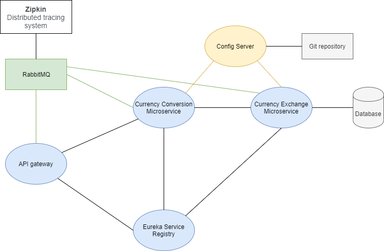

# microservices-spring-cloud

This project presents a simple view of microservices architecture. Microservices are implement using Spring Cloud and Spring Boot.

 

In the picture above you can see a diagram that shows all the services and connections in this project.
##### API gateway
* responsible for request routing. The Gateway intercepts all requests from clients. It then routes the requests to the appropriate microservice.
##### Currency Exchange Microservice
* check in databse what is the exchange rate of one currency to another
##### Currency Conversion Microservice
* responsible for converting some quantity currency to another

So it call the **Currency Exchange Microservice** and ask what is the currency value (for example INR to USA) and then return the value (that might be 65). 
**Currency Conversion Microservice** take the value and multiply it by quantity (10) and return response back with connversion value (650).
##### Eureka Service Registry
* all instance of all the microservices in project is registry with a service registry
Eureka naming server is an application that holds information about all client service applications. 
Each microservice registers itself with the Eureka naming server. The naming server registers the client services with their port numbers and IP addresses.
##### Config Server
* provides a centralized server for delivering external configuration properties to an application 
and a central source for managing this configuration across deployment environments.
##### **Zipkin** - distributed tracing system
>Spring Cloud Sleuth and Zipkin
* Spring Cloud Sleuth: A Spring Cloud library that lets you track the progress of subsequent microservices by adding trace and span id's on the appropriate HTTP request headers. 

* Zipkin is distributed tracing application that helps gather timing data for every request propagated between independent services
